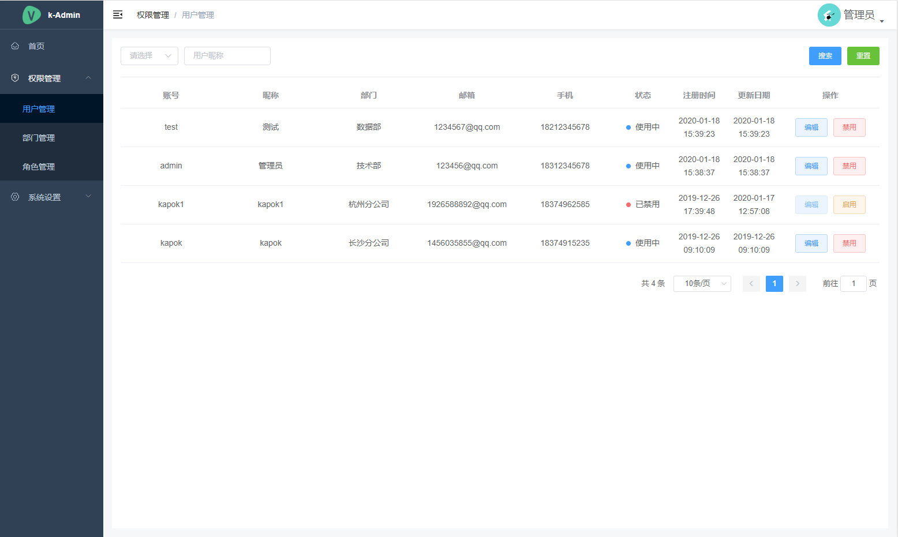
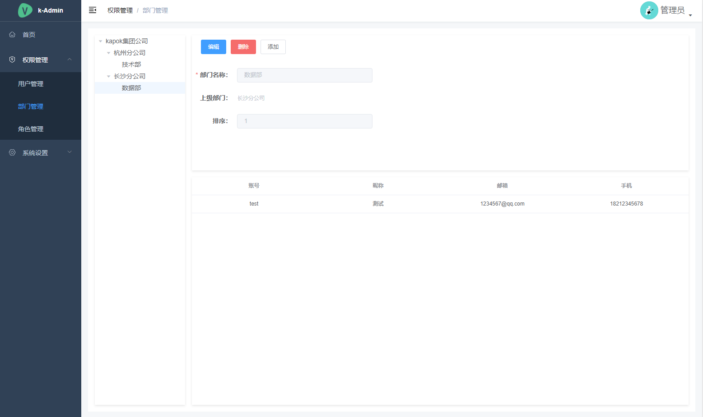
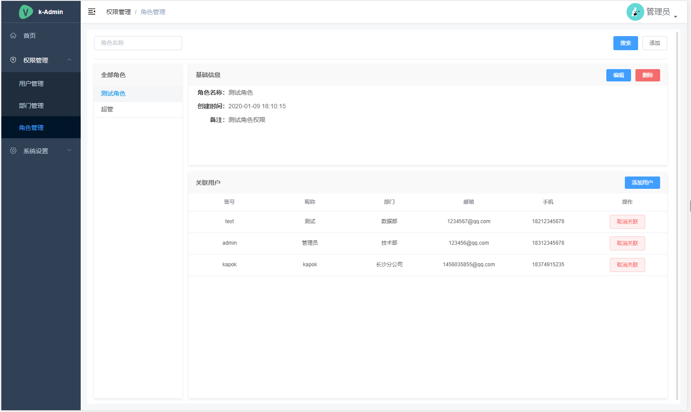
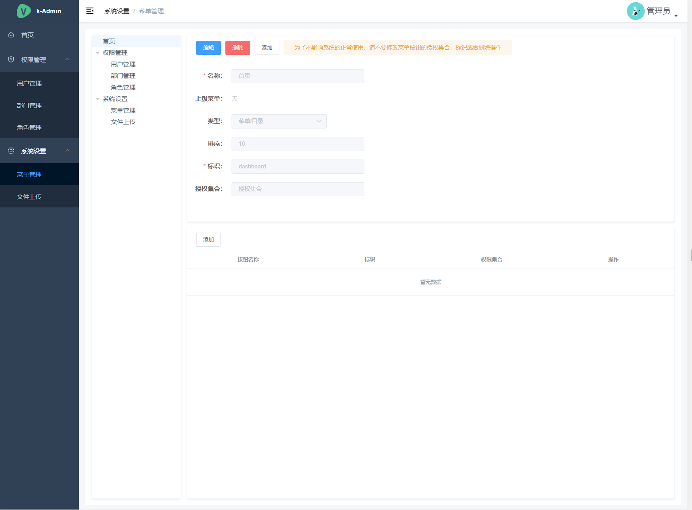
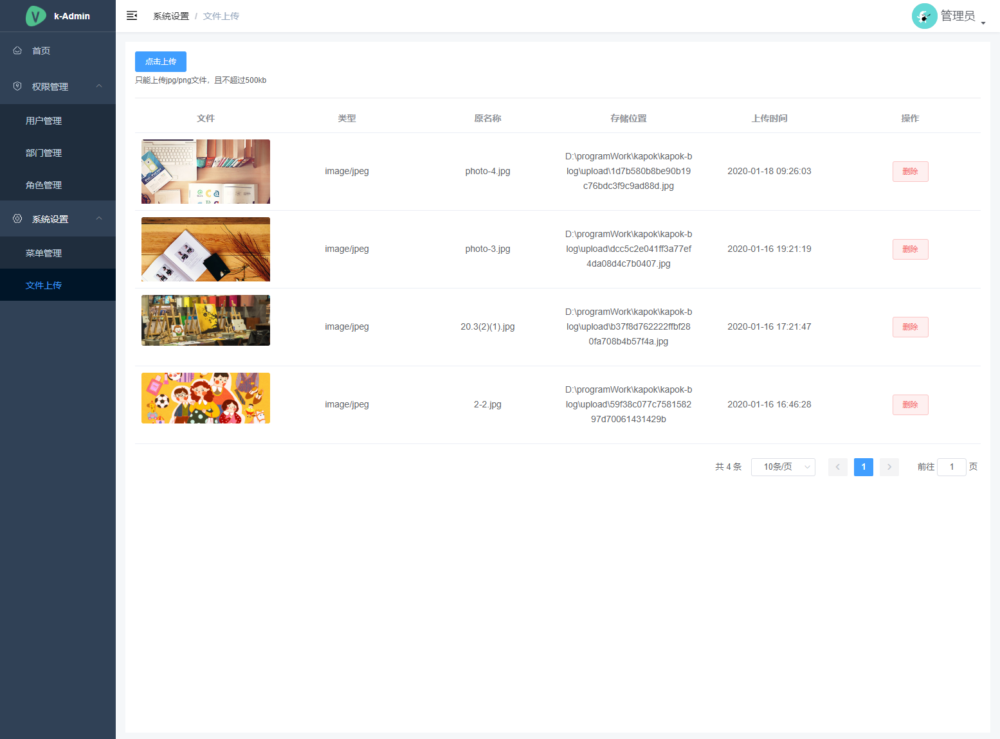

<div align="center">
<br/>
<br/>
  <h1 algin="center">
    Nest Admin
  </h1>
</div>

<p align="center">
  <a href="#">
    
  </a>
  <a href="#">
    
  </a>
  <a href="#">
    
  </a>
</p>

#### 项目说明

```Nest Admin``` 管理系统，是基于 ```Nestjs```，```Vue``` 打造出的一站式 RBAC 管理平台。

核心模块包括： 用户、角色、菜单、岗位、部门、日志、文件管理等功能。提供了丰富的功能组件，它可以帮助您快速搭建企业级中后台产品原型。

* [github](https://github.com/wenqiyun/nest-admin)
* [gitee](https://gitee.com/wenqiyun/nest-admin)
* [文档](https://wenqiyun.github.io/nest-admin)
* [国内文档](https://wenqiyun.gitee.io/nest-admin)

#### 本地开发

下载源码

```sh
git clone https://github.com/wenqiyun/nest-admin.git
# 或
git clone https://gitee.com/wenqiyun/nest-admin.git
```

前端

```sh
# 打开前端根目录
cd nest-admin/client
# 安装依赖包
npm i
# 本地运行开发
npm run dev
```

后端

> 后端需要 ```MySql``` 、```Redis``` 环境

本项目使用 ```TypeOrm``` 连接 ```MySql``` 数据库， 运行前请在 ```servers/src/config/dev.yml``` 文件中配置好数据库连接

```MySql``` 数据库文件在 ```nest-admin/db/kapok.sql``` ，可以通过 ```MySQL WorkBench``` 或 ```Navicat``` 等工具软件导入。

```sh
# 打开后端根目录
cd nest-admin/servers
# 如果 安装不成功，建议使用 pnpm i
npm i
# 本地运行开发
npm run start:dev
```

启动好前、后端后，浏览器访问 <http://localhost:5173> 即可打开页面， swagger 文档地址 <http://localhost:8081/api/docs>

在线预览：[http://nest-admin.shenyuan.xn--6qq986b3xl/](http://nest-admin.shenyuan.xn--6qq986b3xl/)

演示账号：

|   账号  |  密码   |    权限    |
| :-----: | :-----: | :--------: |
|  admin  |  admin  | 超级管理员 |
|  test   | Q123456 | 测试用户   |

> 批量导入的用户默认密码： Q123456 ， 可在 ```servers/src/config``` 中配置 初始密码

#### 功能

* [X] 用户管理
* [X] 角色管理
* [X] 部门管理
* [X] 岗位管理
* [X] 菜单管理
* [X] 文件上传（当前只完成上传本地，未兼容 oss）
* [ ] 定时任务

#### 效果图











如果你觉得这个项目帮助到了你，你可以帮作者买一杯果汁表示鼓励


