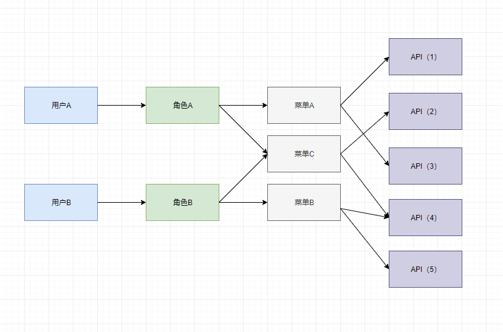
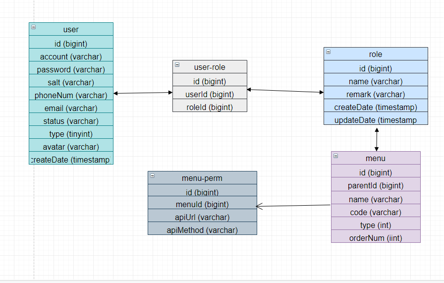

#### RBAC

```RBAC``` 是基于与角色访问控制（ ```Role Based Access Control``` ）在 ```RBAC``` 中，权限与角色关联，用户通过拥有适当的角色而得到相应的（api）权限。

用户拥有当前角色下对应的权限，一个用户可以有多个角色，每个角色都可以有多个菜单，一个菜单可能绑定了多个 API 路由



> [!TIP]
> 如上图所示，用户A最终拥有访问 API1、API2、API3、API4 的权限；
>
> 用户B则拥有 API2、API4、API5 的访问权限。

#### 数据库表设计



> [!WARNING]
> 本项目中表关联关系采用业务逻辑关联，没有使用外键！

#### 关于主键使用 bigint 类型

```javascript``` 对数据库中的 ```int``` 和 ```bigint``` 区别对待


刚开始开发中，测试数据库 ```id``` 字段采用 ```int``` ， 数据库 ```SELECT``` 返回结果是 ```number``` 类型，但是使用 ```bigint``` 数据库返回的是 ```string``` ，初步猜想是因为 ```bigint``` 的值会超过 ```number``` 的范围，所以采用 ```string```

经查 ```TypeOrm``` 文档， 解决方案是在数据库连接配置
```javascript
{
  ...
  supportBigNumbers: true
  bigNumberStrings: true
}
```


