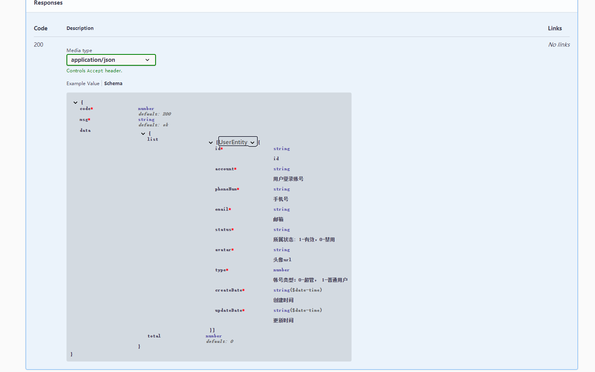

在本项目中接口返回的数据格式，是封装了一层，如下：
```javascript
class ResultData<T> {
  code: 200,
  msg: 'ok',
  data: T
}
```
但是在开发的过程中发现，swagger 文档不支持泛型，返回的泛型在 api doc 上显示为空。

> [!TIP]
> 由于 Typescript 不存储有关泛型或接口的元数据，要实现以上 data 只能 显示指定类型，或者使用如下方式。

经过查阅[官方文档](https://docs.nestjs.com/openapi/operations#advanced-generic-apiresponse)，可通过 ```schema``` 的方式实现。

实现方式如下：

#### 封装返回类 ResultData

```javascript
export class ResultData {
  constructor(code = 200, msg?: string, data?: any) {
    this.code = code
    this.msg = msg || 'ok'
    this.data = data || null
  }

  @ApiProperty({ type: 'number', default: 200 })
  code: number

  @ApiProperty({ type: 'string', default: 'ok' })
  msg?: string

  data?: any

  static ok(data?: any, msg?: string): ResultData {
    return new ResultData(200, msg, data)
  }

  static fail(code: number, msg?: string, data?: any): ResultData {
    return new ResultData(code || 500, msg || 'fail', data)
  }
}
```

#### swagger 返回数据 ApiResult 装饰器
```javascript
const baseTypeNames = ['String', 'Number', 'Boolean']
/**
 * 封装 swagger 返回统一结构
 * 支持复杂类型 {  code, msg, data }
 * @param model 返回的 data 的数据类型
 * @param isArray data 是否是数组
 * @param isPager 设置为 true, 则 data 类型为 { list, total } , false data 类型是纯数组
 */
export const ApiResult = <TModel extends Type<any>>(model?: TModel, isArray?: boolean, isPager?: boolean) => {
  let items = null
  if (model && baseTypeNames.includes(model.name)) {
    items = { type: model.name.toLocaleLowerCase() }
  } else {
    items = { $ref: getSchemaPath(model) }
  }
  let prop = null
  if (isArray && isPager) {
    prop = {
      type: 'object',
      properties: {
        list: {
          type: 'array',
          items
        },
        total: {
          type: 'number',
          default: 0
        }
      }
    }
  } else if (isArray) {
    prop = {
      type: 'array',
      items
    }
  } else if (model) {
    prop = items
  } else {
    prop = { type: 'null', default: null }
  }
  return applyDecorators(ApiOkResponse({
    schema: {
      allOf: [
        { $ref: getSchemaPath(ResultData) },
        {
          properties: {
            data: prop
          }
        }
      ]
    }
  }))
}
```

#### 使用 ApiResult 装饰器
```javascript
// UserController
@ApiTags('用户账号相关')
@ApiExtraModels(ResultData, UserEntity)
@Controller('user')
export class UserController {
  constructor(private readonly userService: UserService) {}

  @Get('list')
  @ApiOperation({ summary: '查询用户列表' })
  @ApiResult(UserEntity, true, true)
  async findList (@Query() dto: FindUserListDto): Promise<ResultData> {
    return await this.userService.findList(dto)
  }
  ......
}
```

如图





> [!WARNING]
> 由于 ResultData UserEntity 没有被任何控制器直接引用， 因此 SwaggerModel 还不能生成相应的 model ， 在这种情况下我们必须将其添加为 ```Extra Model```。 也就是使用 ```@ApiExtraModels(ResultData, UserEntity)``` 的方式。
